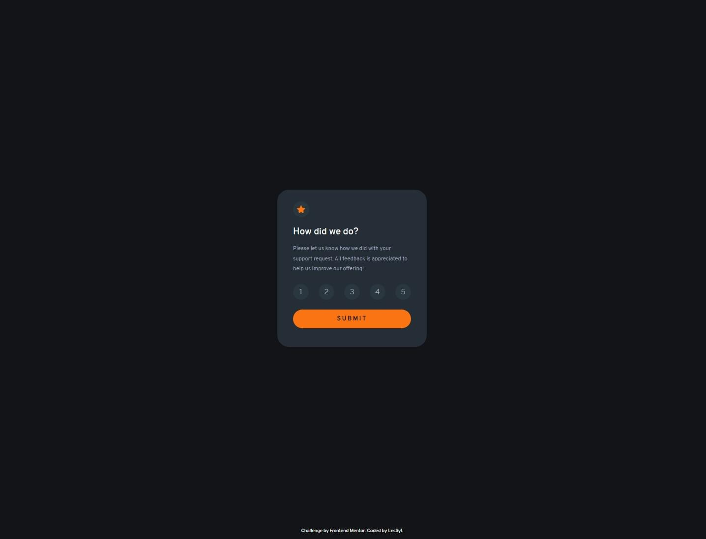
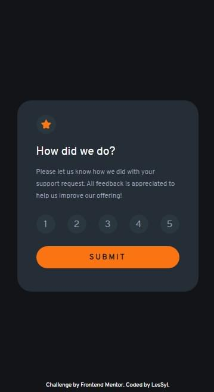

# Frontend Mentor - Interactive rating component solution

This is a solution to the [Interactive rating component challenge on Frontend Mentor](https://www.frontendmentor.io/challenges/interactive-rating-component-koxpeBUmI). Frontend Mentor challenges help you improve your coding skills by building realistic projects. 

## Table of contents
- [Overview](#overview)
  - [Screenshot](#screenshot)
  - [Links](#links)
- [My process](#my-process)
  - [Built with](#built-with)
  - [What I learned](#what-i-learned)
- [Author](#author)

## Overview

### Screenshot

Desktop

Mobile

### Links

- Repository URL:[GitHub](https://github.com/LesSyl/Interactive-rating-component)
- Solution URL: [Frontendmentor]()
- Live Site URL: [Live](https://lessyl.github.io/Interactive-rating-component/)
## My process

### Built with

- Semantic HTML5 markup
- Mobile-first workflow
- Sass
- BEM
- Flexbox
- animation
- JS

### What I learned

During the creation of the project, I learned many new things that significantly expanded my programming skills. First and foremost, I understood how to efficiently manipulate DOM elements using JavaScript, such as dynamically adding and removing classes or checking the focus state of elements. I also learned how to use CSS animations to create smooth visual effects, like moving elements at a slow pace. Working with event listeners, particularly focus and blur, helped me better manage user interactions. Additionally, I gained practical experience in code optimization, which makes it easier to scale and keep the code readable.

## Author

- Frontend Mentor - [@LesSyl](https://www.frontendmentor.io/profile/LesSyl)
- gitHub - [@LesSyl](https://github.com/LesSyl)